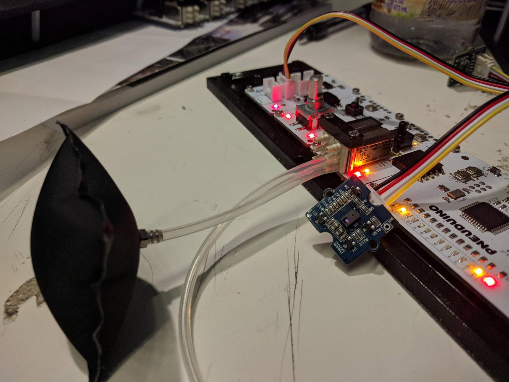

## I2C Gesture Sensor
**Boards:** Master, valve board, and Grove extension board 
**Tube connections:** Connect tubes as shown below

 

Pneuduino has an extension board that allows Grove I2C sensors to be easily incorporated into the system. On the software side, the Pneuduino library can be used together with sensor libraries, allowing sensor data to easily control pneumatic functions. This example shows the use of the Grove Gesture v1.0 sensor to control inflation and deflation.

Plug the gesture sensor into the extension board. Connect the output of the left valve to the inflatable, and connect the supply port to the compressed air supply. When the gesture sensor detects your hand moving towards it, the valve is opened. Air flows into the inflatable, simulating the effect of being pushed by your hand. When your hand moves away from the sensor, air is released.
